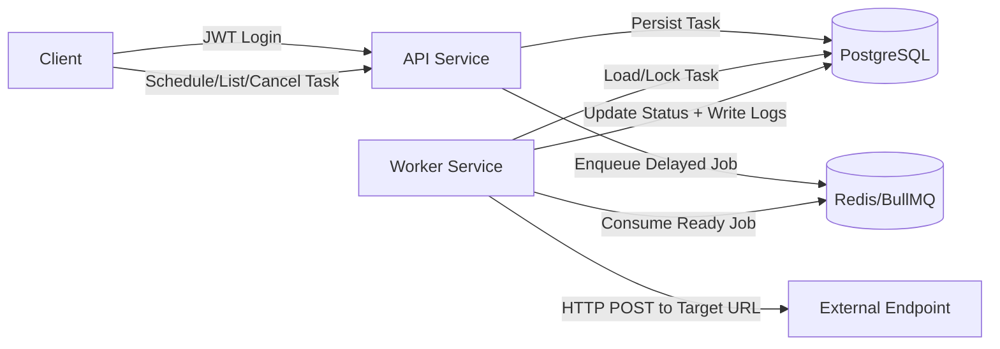

# Task Scheduler Service

Distributed scheduled notification/action service with:
- API service for secure task scheduling and management
- Worker service for delayed execution and retry handling
- PostgreSQL persistence for tasks and execution logs
- Redis + BullMQ for delayed/asynchronous job processing

## Architecture Diagram



## Service Communication Flow

1. Client authenticates via `POST /auth/login`.
2. API validates JWT on task endpoints.
3. `POST /tasks` stores a task in PostgreSQL (`PENDING`) and enqueues a delayed BullMQ job with retries.
4. Worker consumes job at scheduled time, marks task `RUNNING`, executes external HTTP call, and updates task status.
5. Worker persists attempt-level execution logs for success/failure and retry metadata.
6. `DELETE /tasks/:id` cancels pending tasks and removes queued jobs.

## Database Schema

### `tasks`
- `id` (UUID, PK)
- `url` (string, required)
- `payload` (jsonb, required)
- `status` (`PENDING|RUNNING|COMPLETED|FAILED|CANCELED`)
- `scheduledAt` (timestamp, indexed with `status`)
- `attempts` (int)
- `maxAttempts` (int)
- `nextRetryAt` (timestamp, nullable)
- `executedAt` (timestamp, nullable)
- `canceledAt` (timestamp, nullable)
- `lastError` (text, nullable)
- `createdAt`, `updatedAt`

Indexes:
- `idx_tasks_status_scheduled_at` on `(status, scheduledAt)` for time-based lookup/filtering.

### `task_execution_logs`
- `id` (UUID, PK)
- `taskId` (UUID, indexed with created timestamp)
- `attempt` (int)
- `status` (`PENDING|COMPLETED|FAILED`)
- `httpStatus` (int, nullable)
- `responseBody` (jsonb, nullable)
- `error` (text, nullable)
- `createdAt`

Indexes:
- `idx_logs_task_id_created_at` on `(taskId, createdAt)`.

## Scheduling and Worker Logic

- Task scheduling:
  - Validates URL and future `scheduledAt`.
  - Persists task via service -> repository layer.
  - Enqueues delayed BullMQ job (`jobId = taskId`) with exponential backoff and max attempts.

- Worker execution:
  - Fetches and row-locks task in transaction.
  - Transitions task to `RUNNING` and increments attempt counter atomically.
  - Executes external HTTP `POST` with payload.
  - Success: marks `COMPLETED`, writes success log.
  - Failure: writes error + log, transitions to `PENDING` if retry remains or `FAILED` if exhausted.

## API Endpoints

### Authentication
- `POST /auth/login`
  - Body:
    ```json
    {
      "username": "admin",
      "password": "admin123"
    }
    ```
  - Response:
    ```json
    {
      "accessToken": "<jwt>"
    }
    ```
  - Also sets `access_token` cookie (`HttpOnly`) for local testing.

### Tasks (Auth required)
- `POST /tasks`
- `GET /tasks`
- `GET /tasks/:id`
- `GET /tasks/:id/logs`
- `DELETE /tasks/:id`

Auth is accepted via either:
- `Authorization: Bearer <jwt>`
- `access_token` cookie set by `/auth/login`

Schedule payload example:
```json
{
  "url": "https://httpbin.org/post",
  "payload": { "message": "Hello" },
  "scheduledAt": "2026-03-10T10:00:00.000Z",
  "maxAttempts": 5
}
```

## Local Run (Docker)

```bash
docker compose up --build
```

Services:
- API: `http://localhost:3000`
- Worker: background consumer
- PostgreSQL: `localhost:5432`
- Redis: `localhost:6379`

## Environment Variables

| Variable | Default |
|---|---|
| `PORT` | `3000` |
| `DB_HOST` | `postgres` |
| `DB_PORT` | `5432` |
| `DB_USER` | `postgres` |
| `DB_PASSWORD` | `postgres` |
| `DB_NAME` | `scheduler` |
| `REDIS_HOST` | `redis` |
| `REDIS_PORT` | `6379` |
| `JWT_SECRET` | `scheduler-secret` |
| `JWT_EXPIRES_IN` | `12h` |
| `AUTH_USERNAME` | `admin` |
| `AUTH_PASSWORD` | `admin123` |

## Deployment Notes (Render/Fly.io)

1. Deploy API and Worker as separate services from the same repo.
2. Provision managed PostgreSQL and Redis.
3. Configure shared env vars for both services.
4. API start command: `npm run start:prod`
5. Worker start command: `npm run start:worker`

## Scaling Considerations

1. Run multiple worker replicas; BullMQ supports competing consumers.
2. Use PostgreSQL connection pooling and tune worker concurrency.
3. Add dead-letter queue and alerting for permanently failed tasks.
4. Partition/archive execution logs for long-term volume growth.
5. For strict at-least-once guarantees at scale, add idempotency keys on target endpoints.
